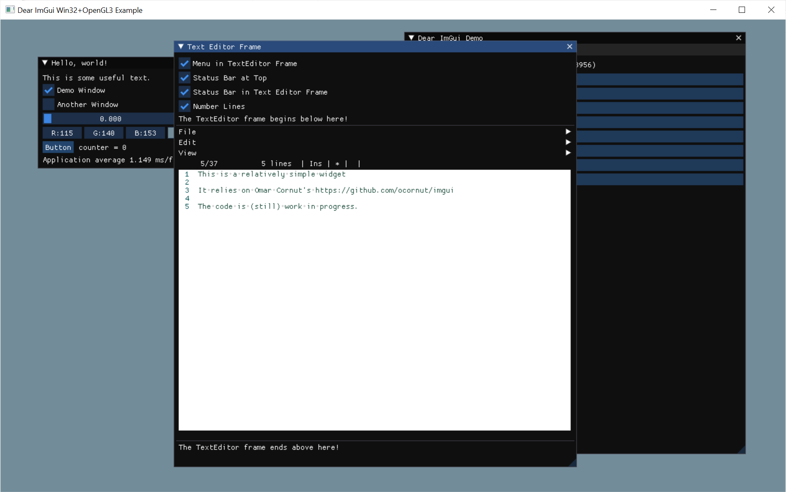

# ImGuiColorTextEdit
Syntax highlighting text editor for ImGui

To use in your own projects you really only need these files
ImGuiDebugPanel.cpp
LanguageDefinitions.cpp
TextEditor.cpp
TextEditor.h
TextEditorDemo.cpp
UnitTests.cpp

To run the demo

//clone imgui

// copy the ImGuiColorTextEdit folder into your desired example_... folder
// add .\ImGuiColorTextEdit to c++ include directory of the appropriate example... project (remember both debug and release)

// include TextEditor.h and the following definitions into example...\main.cpp
#include "TextEditor.h"
int TextEditorDemo();

// add a call to the demo  into example...\main.cpp

// 4. Show a textEditor frame in a simple window.
TextEditorDemo();

It should look like this:

This started as  BalazsJakos attempt to write a relatively simple widget which provides text editing functionality with syntax highlighting. Now there are other contributors who provide valuable additions.
The project was dead for a very long time, but has now reforked and revitalised!

While it relies on Omar Cornut's https://github.com/ocornut/imgui, it does not follow the "pure" one widget - one function approach. Since the editor has to maintain a relatively complex and large internal state, it did not seem to be practical to try and enforce fully immediate mode. It stores its internal state in an object instance which is reused across frames.

The code is (still) work in progress, please report if you find any issues.

# Main features
 - approximates typical code editor look and feel (essential mouse/keyboard commands work - I mean, the commands _I_ normally use :))
 - undo/redo
 - UTF-8 support
 - works with both fixed and variable-width fonts
 - extensible syntax highlighting for multiple languages
 - identifier declarations: a small piece of description can be associated with an identifier. The editor displays it in a tooltip when the mouse cursor is hovered over the identifier
 - error markers: the user can specify a list of error messages together the line of occurence, the editor will highligh the lines with red backround and display error message in a tooltip when the mouse cursor is hovered over the line
 - large files: there is no explicit limit set on file size or number of lines (below 2GB, performance is not affected when large files are loaded (except syntax coloring, see below)
 - color palette support: you can switch between different color palettes, or even define your own
 - whitespace indicators (TAB, space)
 
# Known issues
 - syntax highligthing of most languages - except C/C++ and Lua - is based on std::regex, which is diasppointingly slow. Because of that, the highlighting process is amortized between multiple frames. C/C++ and Lua have a hand-written tokenizer which is much faster. 
 
Please post your screenshots if you find this little piece of software useful. :)

# Contribute

If you want to contribute, please refer to CONTRIBUTE file.
